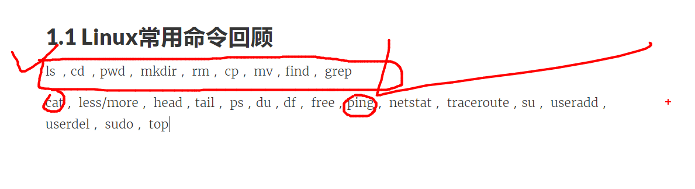
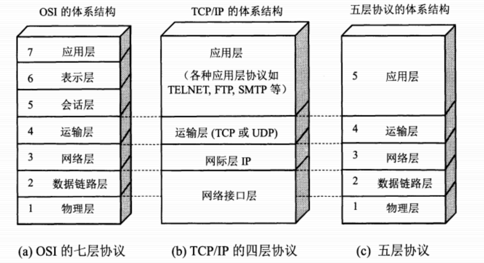
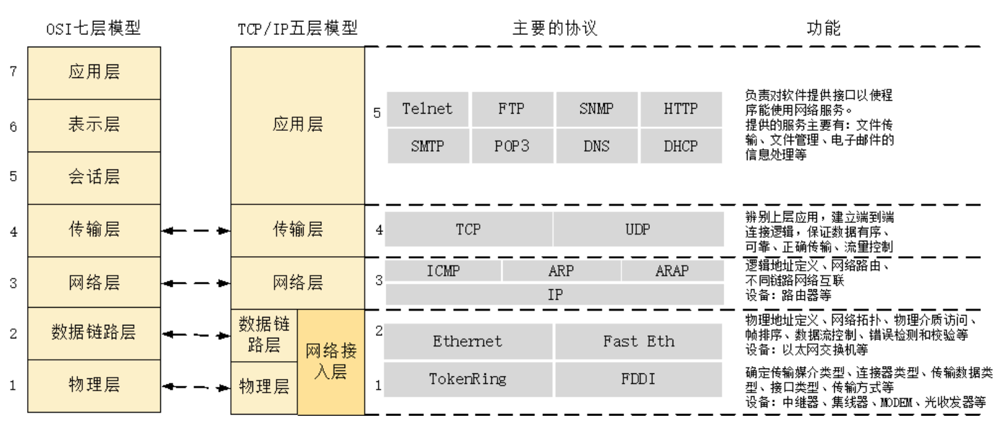
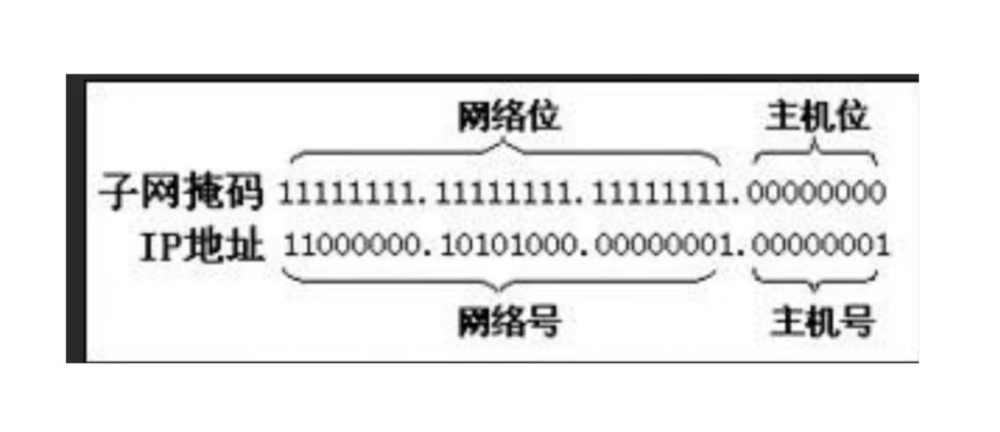
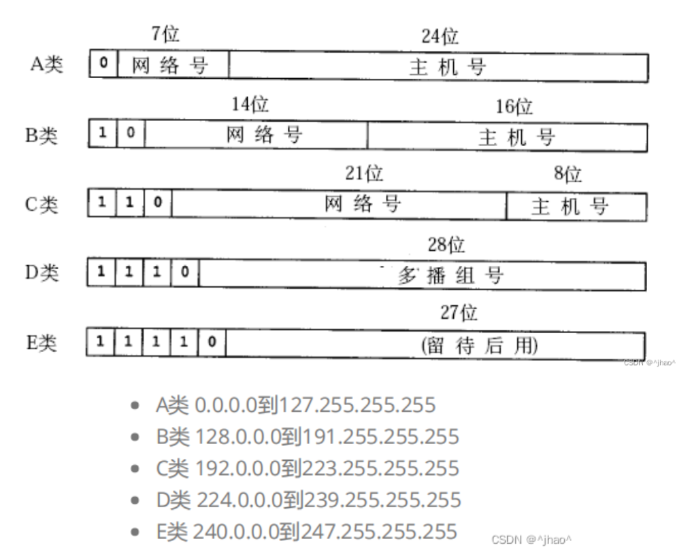

[TOC]

# 1. Linux

## 1.1 Linux 常用命令

- **最常用**

  

  - **ls   参数**

    - ```bash
      ls -a            # 包括隐藏文件  all
      ls -l  / ll      # 详细包括了权限  list
      ll -i  / ls -li  # 显示详细信息  i inode
      ll -h            # 显示字节大小 h
      ```

  - **ln 硬 软连接**

    - ```bash
      ln test.c /root/wang.c           #硬链接
      
      #[root@localhost ~]# ln 123.txt /root/1231.txt
      #[root@localhost ~]# ll -i
      #total 668
      #8541140 -rw-r--r--  2 root root      9 Dec 27 14:41 1231.txt
      #8541140 -rw-r--r--  2 root root      9 Dec 27 14:41 123.txt
      
      ln -s test.c /root/wang_link.c   # 软链接
      
      #[root@localhost ~]# ln -s 123.txt /root/123txt_soft_link
      #[root@localhost ~]# ll -i
      #total 668
      # 8541140 -rw-r--r--  2 root root      9 Dec 27 14:41 1231.txt  
      # 8541140 -rw-r--r--  2 root root      9 Dec 27 14:41 123.txt
      #10370945 lrwxrwxrwx  1 root root      7 Dec 27 16:11 123txt_soft_link -> 123.txt
      
      ```

      - 第三列

        - 文件 类型代表 硬链接 个数

        - 目录 代表子文件的个数 (其中包括2个隐藏文件)

        - 扩展

          - **硬链接**

            - 类似一个拷贝副本，指向同一数据块，inode号 一致 

            - **硬链接不能跨文件系统** 

              - ```bash
                [root@localhost ~]# ln 2.txt /dev/2_hard_link       ln +  文件位置  +  生成文件的目标位置
                ln: failed to create hard link ‘/dev/2_hard_link’ => ‘2.txt’: Invalid cross-device link
                ```

            - **不可给目录建立**

              - ```bash
                [root@localhost ~]# tree
                .
                ├── 1231.txt
                ├── 123.txt
                ├── 123txt_soft_link -> 123.txt
                ├── 2
                │   └── 2.txt
                ├── 2.txt
                ├── anaconda-ks.cfg
                ├── big.file
                └── hello
                
                [root@localhost ~]# ln 2 /home/xiemu/2_hard_link
                ln: ‘2’: hard link not allowed for directory  
                ```

                

              

            - **软链接**

              - **软链接 可跨文件系统**  

              - 可给目录建立

                ```bash
                [root@localhost dev]# ll -i
                total 0
                48994 lrwxrwxrwx 1 root root           5 Dec 27 17:00 2_soft_link -> 2.txt
                ```

                

              - 类似快捷方式，别名 inode号不一样  源文件删除 软链接不可用

                

    

  - **cd** 

    - **三个方法回到 当前用户 家目录**

      - ```bash
        cd /绝对路径
        cd ~
        cd
        ```

  - **pwd**

  - **mkdir**

    - ```bash
      mkdir
      mkdir -p   #多级目录
      
      [root@localhost ~]# mkdir /root/12/2/2/2
      mkdir: cannot create directory ‘/root/12/2/2/2’: No such file or directory
      [root@localhost ~]# mkdir -p /root/12/2/2/2
      [root@localhost ~]# tree
      .
      ├── 1
      ├── 12
      │   └── 2
      │       └── 2
      │           └── 2
      ├── 1231.txt
      ├── 123.txt
      ├── 123txt_soft_link -> 123.txt
      ├── 2
      │   ├── 1231_hard_link
      │   └── 2.txt
      ├── 2.txt
      ├── anaconda-ks.cfg
      ├── big.file
      └── hello
      
      ```

  - **rm**

    - ```bash
      rm -f       # 强制删除文件
      rm -r       # 递归删除 目录
      rm -rf      # 强制递归删除 目录
      ```

  - **rmdir** 

    - ```bash
      rmdir 删除空目录
      rmdir -p  删除多级目录
      ```

  - **cp**

    - ```bash
      cp test /root/aaa  #拷贝文件
      cp -r c /root/bb   #拷贝目录
      ```

  - **mv**

    - ```bash
      mv test.c / root/aaa #移动文件
      ```

  - **whoami**

    - ```bash
      [root@localhost ~]# whoami   # 查看当前用户
      root
      [root@localhost ~]# su - xiemu
      Last login: Wed Dec 27 16:29:01 CST 2023 on pts/0
      [xiemu@localhost ~]$ whoami
      xiemu
      ```

  - **man** 

    - ```bash
      man vim   # 查看帮助
      ```

  - **find**

    - ```bash
      find / -name "ccc.text" #根目录下寻找
      find /root -name "ccc.txt" #指定目录寻找
      find /root -name "ccc.txt" -type f #指定目录 限定 寻找文件
      find / -size +500M -tpye f #指定目录 限定 文件大小
      ```

  - **grep**

    - ```bash
      grep          # 默认 全搜
      grep -w       # 只搜关键词
      grep -v       # 取反 去除关键词
      grep -i       # 忽略大小写
      grep -r .     # 再不知道详细目录的情况下   当前目录 递归搜索， 
      ```

      ```bash
      [root@localhost ~]# cat 2.txt
      wode wode  
      wode Wo
      de
      WOOO
      wo
      
      [root@localhost ~]# grep "wo" 2.txt
      wode wode  
      wode Wo
      wo
      [root@localhost ~]# grep -w "wo" 2.txt
      wo
      [root@localhost ~]# grep -v "wo" 2.txt
      de
      WOOO
      [root@localhost ~]# grep -i "wo" 2.txt
      wode wode  
      wode Wo
      WOOO
      wo
      
      [root@localhost ~]# clear
      [root@localhost ~]# grep -r "wode" .
      ./2.txt:wode wode  
      ./2.txt:wode Wo
      ./2/2.txt:wode wode wode 
      ```

  - **cat**     

    ```bash
    cat                  #长文件 自动跳转最后一页 
    cat -n 111.txt 	     # 查看时 显示行
    ```

  - **less**   长文件

  - **more**  长文件 显示百分比

  - **head**  

    - ```bash
      head -3 11.txt # 前3行
      ```

  - **tail**   用于看日志

    - ```bash
      tail -2 11.txt #后2行
      tail -f 11.txt  #查看文件的变化过程  一般用于看日志
      ```

  - **sed**

    - ```bash
      #指定行
      head -4 11.txt | tail -1
      sed -n '3p' 11.txt
      ```

  - **ps   看进程**

    - ```bash
      ps -ef | grep ping | grep -v grep  #和过滤进程一起使用
      ps kill pid                        # 杀死进程
      ps kill -9 pid                     # 强制杀死进程
      
      
      [root@localhost ~]# ps -ef | grep ping
      root       3998   3950  0 18:41 pts/1    00:00:00 ping www.baidu.comn
      root       3999   3950  0 18:42 pts/1    00:00:00 ping www.baidu.com
      root       4234   3641  0 18:54 pts/0    00:00:00 grep --color=auto ping
      [root@localhost ~]# kill -9 3998
      
      ```

  - **du**  看磁盘

    - ```bash
      du -sh  
      du -sh *
      ```

  - **df** 看文件系统

  - **free** 看内存

  - **ping** 

    - ```bash
      ping -c 4 www.baidu.com # 发包数量  一共发4个包
      ```

  - netstat

  - traceroute

  - useradd

  - passwd

  - userdel

  - sudo

  - top

## 1.2 vi 和 vim 使用

- **说明书**

  - ```bash
    vimtutor
    ```

- **底线模式**

  - ```bash
    :w newfilename         #另存为
    :set nu                #设置行号
    :set nonu              # 取消行号
    :syntax on             #高亮
    :syntax off            #关闭高亮
    :!                    #执行命令 不用退出
    ```

- **命令模式  （默认命令模式）**

  - ```bash
    ### 查
    ctrl -f  # 往前翻页  forward
    ctrl -b # 往后翻页  back
    ctrl -d  #往后翻半页  down
    ctrl -u  #往前翻半夜 up
    jkhl    # 上下左右 
    0       # 到行首      
    $       # 到行尾
    gg      # 到一行 行首
    G       # 到最后一行 行首
    10G    #跳转到指定行 例子是 跳转到10行
    w     #往后一个单词 光标在单词前  word
    b     #往前一个单词  光标在单词前 back
    e     #往后移动到单词的尾部     光标在单词后 end 
    / 关键词   #使用关键词搜索  n 向下查找
    ？关键词  # 使用关键词搜索  n 向上查找
    
    #删
    x     #删除单个字符
    dw     #删除一个单词
    2dw    #删除两个单词， 前面加数量指定删除数量
    dd     #删除一行
    8dd    #删除8行
    
    #替换操作
    
    r   #单个字母替换
    cw  #替换一个单词
    cc  #替换一个行
    
    #复制拷贝操作
    
    yw           #复制一个单词
    yy           #复制一行
    p            #拷贝
    
    # 撤销 和 重做
    u            #撤销
    ctrl + r    # 重做
    ```

- **插入模式**

  - ```bash
    i      #插入在光标前
    a      #插入在光标后
    I      #插入在行首
    A      #插入在行末
    o      #下一行插入
    O      #上一行插入
    ```

## 1.3 shell 

### 1.3.1 **查看shell信息**

```bash
[root@localhost ~]# echo $SHELL
/bin/bash
[root@localhost ~]# cat /etc/shells
/bin/sh
/bin/bash
/usr/bin/sh
/usr/bin/bash
/bin/tcsh
/bin/csh

[root@localhost ~]# ll /bin/sh          
lrwxrwxrwx. 1 root root 4 Apr 23  2022 /bin/sh -> bash  #软链接

```

### 1.3.2 **执行shell文件**

- sh   文件
- bash 文件
- chmod 755 文件 ； ./文件名
- export PATH = $PATH:. 添加当前路径； 文件名

```bash
[root@localhost ~]# cat first.sh 
echo "this is my first Linux Shell"
[root@localhost ~]# sh first.sh 
this is my first Linux Shell

[root@localhost ~]# bash first.sh 
this is my first Linux Shell

[root@localhost ~]# chmod 755 first.sh 
[root@localhost ~]# ll
total 664
-rw-------. 1 root root   1260 Apr 23  2022 anaconda-ks.cfg
-rw-r--r--  1 root root 670293 Dec 27 14:04 big.file
-rwxr-xr-x  1 root root     36 Dec 28 09:20 first.sh
[root@localhost ~]# ./first.sh 
this is my first Linux Shell

[root@localhost ~]# export PATH=$PATH:.
[root@localhost ~]# echo $PATH
/usr/local/sbin:/usr/local/bin:/usr/sbin:/usr/bin:/root/bin:.
[root@localhost ~]# first.sh
this is my first Linux Shell
```

### 1.3.3 Shell 语法

- if [  ] then fi

  - 注意必须要又空格

- 参数

- 文件属性 

  ```bash
  echo "this is my first Linux Shell"
  echo "===================================="
  echo "cerate a new directory"
  mkdir newDir
  if [ $? -eq 0 ]
  then
  echo "Created Directory Successfully!"
  else
  echo "Created Failed!!!"
  fi
  cd newDir
  echo "==================================="
  echo "Create a new file named test.cpp"
  if [ -e test.cpp ]
  then
  echo "File test.cpp already exists!"
  else
  touch test.cpp
  echo "File created successfully!"
  fi
  echo "All things are done!" 
  
  #!/bin/bash
  read -p "pelease input a number:" num
  if [ $((num % 2)) -eq 0 ]; then
      echo "$num is an even number."
  else
      echo "$num is an odd number."
  fi
  
  #!/bin/bash
  
  for path in *
  do
  if [ -e "$path" ]; then
      if [ -f "$path" ]; then
          echo "$path is a regular file."
      elif [ -d "$path" ]; then
          echo "$path is a directory."
      else
          echo "$path is neither a regular file nor a directory."
      fi
  else
      echo "$path does not exist."
  fi
  done
  ```

## 1.4 Linux下安装软件的方法

- **yum 安装**

  - yum install 包名 :安装

  - yum remove 包名:卸载

  - yum update 包名:更新软件

  - vum info 包名: 查看软件包的信息

  - yum list installed: 查看系统上所有的安装包

  - yum provides 软件名(命令名)：查询软件或者命令所在的包名

  - **例子**

    - gcc 安装

    ```bash
    yum install gcc gcc-c++ -y
    ```

- **源代码 安装**

  - **安装过程**

    - 下载软件源代安装包（一般都是压缩包）

    - 解压缩软件安装包

    - 然后进行build

      - ```bash
        yum install -y libevent-devel #开发者库
        ```

      - ```bash
        ./configure   #进行配置
        ```

      - ```bash
        make         #编译
        ```

      - ```bash
        make install    #安装
        ```

  - **memcached安装**

    ```bash
    wget https://www.memcached.org/files/memcached-1.6.22.tar.gz  #网址是复制下载链接过来的
    tar zxvf memcached-1.6.22.tar.gz 
    
    ```

- **解压缩**

  - ```bash
    tar zxvf 文件名
    tar zxvf memcached-1.6.22.tar.gz 
    ```

## 1.5 程序从源代码到可执行文件分解过程

- **过程**

  - **预处理**

    - ```bash
      gcc -E test.cpp -o test.ii  # test.ii位预处理的结果
      ```

  - **编译**

    - ```bash
      gcc -S test.ii -o test.s   #生成汇编代码  test.s为结果
      ```

  - **汇编**

    - ```bash
      gcc - c test.cpp   #生成目标文件  test.o为结果
      ```

  - **链接**

    - ```bash
      gcc -lstdc++ test.o -o test # 生成可执行文件test
      ```

      

```bash
[root@localhost ~]# cat test.cpp 
#include <iostream>
using namespace std;

#define XIE 1000

int main()
{
   cout << "Hello World" << endl;
   cout << XIE + 999 << endl;
   
   return 0;
}
[root@localhost ~]# g++ test.cpp -o hello
[root@localhost ~]# ./hello 
Hello World
1999
[root@localhost ~]# 

```

## 1.6 Makefile介绍

​		**编写程序并执行过程一般为：**

1. 用编辑器编写源代码，如.c或.cpp文件
2. 用编译器编译源代码并生成目标文件，例如.0或者.obj文件
3. 用链接器链接目标文件和库文件，生成可执行程序，例如.exe

上述过程可以使用 gcc/g++来进行

```bash
 g++ test.cpp -o hello
```

​		如果源代码很多时，一个个编译会很繁琐，因此需要采用批处理进行批量处理编译文件—make工具

​		make 是自动化编译工具，可以使用一条命令完成编译任务，但是使用make工具需要编写一个规则文件，makefile

```bash
# 文件 student.h

#ifndef STUDENT_H
#define STUDENT_H

#include <iostream>
using namespace std;

class Student
{
   private:
        string m_strName;
        int m_age;

   public:
        Student(string name, int age);
        void showInfo();

};
#endif

#文件 student.cpp

#include "student.h"
Student::Student(string name, int age)
{
        m_strName = name;
        m_age = age;
}

void Student::showInfo()
{
    cout << "Name is" << m_strName << endl;
    cout << "Age is" << m_age << endl;
}

#文件 test.cpp	

#include "student.h"
int main()
{
        Student zs("zhangsan", 20);
        zs.showInfo();

        cout << "Program is over" << endl;
        return 0;
}


#文件 Makefile
hello:test.cpp student.cpp
        g++ test.cpp student.cpp -o hello 


[root@localhost make_into]# make
g++ test.cpp student.cpp -o hello 
[root@localhost make_into]# ll
total 32
-rwxr-xr-x 1 root root 14248 Dec 28 15:50 hello
-rw-r--r-- 1 root root    63 Dec 28 15:43 Makefile
-rw-r--r-- 1 root root   210 Dec 28 15:50 student.cpp
-rw-r--r-- 1 root root   214 Dec 28 15:45 student.h
-rw-r--r-- 1 root root   129 Dec 28 15:50 test.cpp
[root@localhost make_into]# ./hello
Name iszhangsan
Age is20
Program is over

```

## 1.7 动态链接 和 静态链接

```bash

## 动态链接
g++ main.cpp -o hello -L. -l myfunc 
[root@localhost link]# ls
fun.cpp  fun.o  hello  libmyfunc.a  main.cpp
[root@localhost link]# file hello
hello: ELF 64-bit LSB executable, x86-64, version 1 (SYSV), dynamically linked (uses shared libs), for GNU/Linux 2.6.32, BuildID[sha1]=07da65aac98ea50f5f3f1d9ccdf80b7610bcaa3e, not stripped

#静态链接 文件补充

yum install glibc-static libstdc++-static -y

##静态链接
g++ main.cpp -o hello2 -L. -lmyfunc -static
[root@localhost link]# file hello2
hello2: ELF 64-bit LSB executable, x86-64, version 1 (GNU/Linux), statically linked, for GNU/Linux 2.6.32, BuildID[sha1]=50856bdbd7211fc03aa743208cbc7c42b2c32afb, not stripped

# 方法2
g++ func.cpp -fPIC -shared -o libfunc.so
LD LIBRARY PATH =/root/class 102/dvnamic link # 设置一个环境变量
```


下面是将静态链接和动态链接的区别转换成表格形式：

| 特征         | 静态链接                   | 动态链接                     |
| ------------ | -------------------------- | ---------------------------- |
| **时机**     | 编译阶段                   | 运行时                       |
| **库的包含** | 编译时包含所有库文件       | 运行时加载动态链接库         |
| **文件大小** | 相对较大                   | 相对较小                     |
| **执行速度** | 运行时性能相对较好         | 可能在启动时稍有增加         |
| **更新维护** | 每次更新需要重新编译和链接 | 较小的文件，便于更新和维护   |
| **独立性**   | 文件独立，不依赖外部库     | 依赖系统或指定路径的库       |
| **共享性**   | 不支持共享库               | 支持共享库，可被多个程序共用 |

​			这个表格提供了对静态链接和动态链接主要特征的简明比较。在实际应用中，选择使用哪种链接方式通常取决于项目的需求和设计考虑。


# 2. MySQL

# 3. C++

# 4. Qt

# 5. OS

#  6. NetWork

## 6.1 网络基础

### 6.1.1  为什么使用网络模型

- 同台设备进程间通信，可以使用 管道、消息队列、共享内存、信号等，但不同设备之间通信就需要借助网络
- 由于设备类型 和 型号 众多，考虑到兼容性问题，需采用同一的通信标准

### 6.1.2 网络模型





应用层：

FTP（20/21） HTTP(80)  HTTPS (443)  DNS(53)  SMTP(25) POP3(110)  SNMP(161)

SSH(22)  TELNET(23)

传输层:  1000以上

TCP / UDP

网络层：

IP ICMP  IGMP  RIP / OSPF

数据链路层（7层）：

ARP   7层 数据链路层   TCP/IP 网络层

### 6.1.3 IP地址 和 物理地址

IP:       v4    32位

​	       v6   128位

mac ：         48位   物理地址 前三字节 表示生产厂家，后三位表示 生产商分配

**网段划分：**

​		**网络位1  主机位0**  

​		**固定 段号外 划分子网 和 主机** 

​		**分子网 看1的个数** 

​		**分主机 看0的个数**

- IP地址32位，由两部分构成：网络号+主机号

  - 同一局域网下的设备网络号都是一样的

  - 主机号就是设备的号码，各不相同。

- 子网掩码

  - 用来确定网络号占多少位。

  - 子网掩码的表示方式：

    - 192.168.1.1/24  表示前24位是网络号

    - 也可以表示成：255.255.255.0

      

  - 网络号=子网掩码与IP地址进行与运算，也就是把IP地址的主机号都设为0

- **子网划分**

  - 为了提高网络查找效率，指定了不同的网段，也就是不同的子网。

  - 举例1：

    - IP地址：140.252.20.68

    - 子网掩码：255.255.255.0

    - 网络号：140.252.20.0

    - 这个子网的IP地址范围：140.252.20.0-140.252.20.255（实际能使用的IP地址还要减2，因为主机号部分全零是网络号，全1是广播地址）

  - 举例2：

    - IP地址：140.252.20.68

    - 子网掩码：255.255.240.0 前20位是网络号，后12位是主机号

    - 网络号：140.252.16.0

    - 这个子网的IP地址范围：140.252.16.0-140.252.31.255（实际能使用的IP地址还要减2，因为主机号部分全零是网络号，全1是广播地址）

  - 练习1：

    - IP地址：168.195.0.0需要划分出来27个子网，子网掩码是多少？

    - 思路：首先这个IP地址能看出来是个B类的网段，10开头，接着14位网络号，后面16位都是主机号，它的子网掩码是255.255.0.0。前面16位我们不能改，但我们可以拿出主机号的一部分来做网络号，我们需要再划分27个子网，那么每个子网都需要子网的位来表示，27个子网需要5位，因为27转成二进制是11011，所以还需要在原基础上多5位网络位，那就是11111111  11111111  11111000  00000000，这就是子网掩码，转换成十进制是：255.255.248.0

  - 练习2：

    - IP地址：168.195.0.0需要划分出来多个子网，每个子网需要连接700台设备。子网掩码是多少？

    - 思路：700台设备每个都需要IP，都需要主机位来分配，700转换二进制后是1010111100，是一个十位二进制，所以，需要10位主机位，剩下的就是网络位，11111111  11111111  11111100  00000000，转成十进制就是255.255.252.0，这就是符合要求的子网掩码

## 6.2 HTTP


# 7. Algorithm

# 8. Liberal

